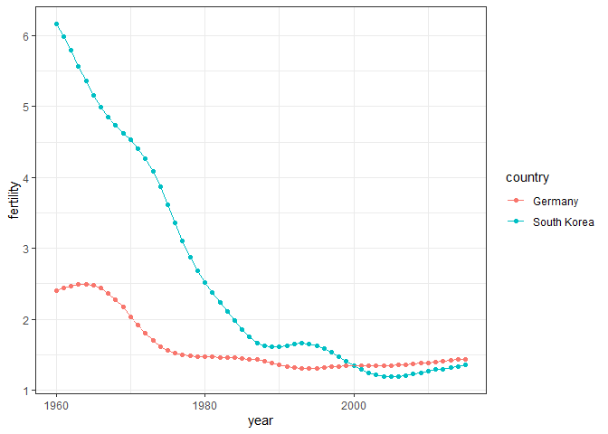
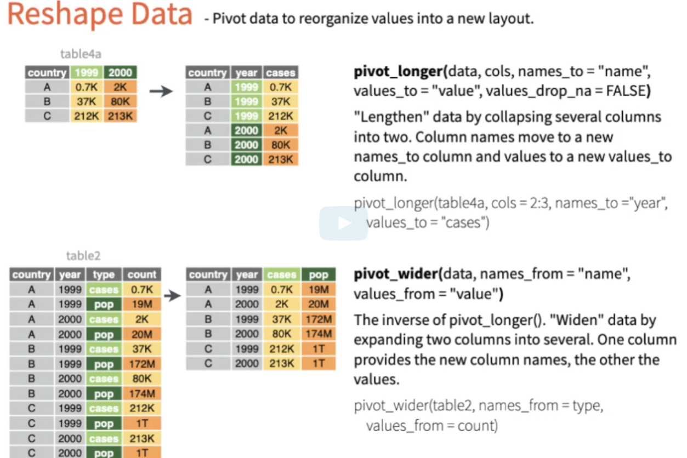

# HarvardX PH125.6x
Mauricio Matoma

# Data Science: Wrangling

## Section 1: Data import

### 1.1. Data Import

#### Paths and the Working Directory

``` r
library(dslabs)
```

Para conocer el directorio de trabajo, se utiliza la función getwd()
(funciona de manera similar a pwd de Unix).

``` r
getwd()
```

    [1] "D:/Documentos/R/HarvardX_PH125/PH125.6x/HarvardX_PH125.6x"

Se cambia la dirección de trabajo con setwd(). Para este caso, se
utilizarán datos dummy del paquete dslabs

``` r
path  <-  system.file("extdata", package = "dslabs")
list.files(path)
```

     [1] "2010_bigfive_regents.xls"                               
     [2] "calificaciones.csv"                                     
     [3] "carbon_emissions.csv"                                   
     [4] "fertility-two-countries-example.csv"                    
     [5] "HRlist2.txt"                                            
     [6] "life-expectancy-and-fertility-two-countries-example.csv"
     [7] "murders.csv"                                            
     [8] "olive.csv"                                              
     [9] "RD-Mortality-Report_2015-18-180531.pdf"                 
    [10] "ssa-death-probability.csv"                              

Extraer la ruta completa de un archivo a través de file.path()

``` r
filename <- "murders.csv"
fullpath <- file.path(path,filename)
fullpath
```

    [1] "C:/Users/matom/AppData/Local/R/win-library/4.3/dslabs/extdata/murders.csv"

Copiar el archivo dentro del proyecto

``` r
file.copy(fullpath, getwd())
```

    [1] FALSE

``` r
file.exists(filename)
```

    [1] TRUE

#### The readr and readxl Packages

La función read_lines() permite revisar los encabezados de un archivo,
por ejemplo:

``` r
library(readr)
read_lines("murders.csv", n_max=3)
```

    [1] "state,abb,region,population,total" "Alabama,AL,South,4779736,135"     
    [3] "Alaska,AK,West,710231,19"         

Leer el archivo:

``` r
dat <- read.csv("murders.csv")
head(dat)
```

           state abb region population total
    1    Alabama  AL  South    4779736   135
    2     Alaska  AK   West     710231    19
    3    Arizona  AZ   West    6392017   232
    4   Arkansas  AR  South    2915918    93
    5 California  CA   West   37253956  1257
    6   Colorado  CO   West    5029196    65

Leer datos con función de base R

``` r
dat2 <- read.csv(filename)
head(dat2)
```

           state abb region population total
    1    Alabama  AL  South    4779736   135
    2     Alaska  AK   West     710231    19
    3    Arizona  AZ   West    6392017   232
    4   Arkansas  AR  South    2915918    93
    5 California  CA   West   37253956  1257
    6   Colorado  CO   West    5029196    65

``` r
class(dat2)
```

    [1] "data.frame"

#### Downloading Files from the Internet

La función read_csv() importa directamente los archivos a partir de una
url

``` r
url <- "https://raw.githubusercontent.com/rafalab/dslabs/master/inst/extdata/murders.csv"
dat <- read.csv(url)
```

Para tener un archivo local, se descarga el archivo

``` r
download.file(url, "murders.csv")
```

#### Assessment Part 2: Data Import

``` r
url <- "https://archive.ics.uci.edu/ml/machine-learning-databases/breast-cancer-wisconsin/wdbc.data"
data <- read_csv(url, col_names = FALSE)
head(data)
```

    # A tibble: 6 × 32
           X1 X2       X3    X4    X5    X6     X7     X8     X9    X10   X11    X12
        <dbl> <chr> <dbl> <dbl> <dbl> <dbl>  <dbl>  <dbl>  <dbl>  <dbl> <dbl>  <dbl>
    1  8.42e5 M      18.0  10.4 123.  1001  0.118  0.278  0.300  0.147  0.242 0.0787
    2  8.43e5 M      20.6  17.8 133.  1326  0.0847 0.0786 0.0869 0.0702 0.181 0.0567
    3  8.43e7 M      19.7  21.2 130   1203  0.110  0.160  0.197  0.128  0.207 0.0600
    4  8.43e7 M      11.4  20.4  77.6  386. 0.142  0.284  0.241  0.105  0.260 0.0974
    5  8.44e7 M      20.3  14.3 135.  1297  0.100  0.133  0.198  0.104  0.181 0.0588
    6  8.44e5 M      12.4  15.7  82.6  477. 0.128  0.17   0.158  0.0809 0.209 0.0761
    # ℹ 20 more variables: X13 <dbl>, X14 <dbl>, X15 <dbl>, X16 <dbl>, X17 <dbl>,
    #   X18 <dbl>, X19 <dbl>, X20 <dbl>, X21 <dbl>, X22 <dbl>, X23 <dbl>,
    #   X24 <dbl>, X25 <dbl>, X26 <dbl>, X27 <dbl>, X28 <dbl>, X29 <dbl>,
    #   X30 <dbl>, X31 <dbl>, X32 <dbl>

``` r
nrow(data)
```

    [1] 569

``` r
ncol(data)
```

    [1] 32

## Section 2: Tidy Data

### 2.1. Reshaping Data

#### Tidy data

``` r
library(dslabs)
library(tidyverse)
path <- system.file("extdata", package = "dslabs")
filename <- file.path(path,"fertility-two-countries-example.csv")
wide_data <- read_csv(filename)
#View(wide_data)
```

``` r
select(wide_data, country, "1960":"1967")
```

    # A tibble: 2 × 9
      country     `1960` `1961` `1962` `1963` `1964` `1965` `1966` `1967`
      <chr>        <dbl>  <dbl>  <dbl>  <dbl>  <dbl>  <dbl>  <dbl>  <dbl>
    1 Germany       2.41   2.44   2.47   2.49   2.49   2.48   2.44   2.37
    2 South Korea   6.16   5.99   5.79   5.57   5.36   5.16   4.99   4.85

#### Reshaping data: pivot_longer

pivot longer utiliza dos argumentos. Primero, el data frame que será
modificado y el segundo argumento contiene las columnas de los valores a
mover.

Por ejemplo, se modificará de esta forma:

``` r
select(wide_data, country, "1960":"1967")
```

    # A tibble: 2 × 9
      country     `1960` `1961` `1962` `1963` `1964` `1965` `1966` `1967`
      <chr>        <dbl>  <dbl>  <dbl>  <dbl>  <dbl>  <dbl>  <dbl>  <dbl>
    1 Germany       2.41   2.44   2.47   2.49   2.49   2.48   2.44   2.37
    2 South Korea   6.16   5.99   5.79   5.57   5.36   5.16   4.99   4.85

A esta forma (nombre de las columnas a niveles de una variable en una
sola columna):

``` r
wide_data %>% pivot_longer("1960":"2015")
```

    # A tibble: 112 × 3
       country name  value
       <chr>   <chr> <dbl>
     1 Germany 1960   2.41
     2 Germany 1961   2.44
     3 Germany 1962   2.47
     4 Germany 1963   2.49
     5 Germany 1964   2.49
     6 Germany 1965   2.48
     7 Germany 1966   2.44
     8 Germany 1967   2.37
     9 Germany 1968   2.28
    10 Germany 1969   2.17
    # ℹ 102 more rows

Nótese que la información se modifica a nombres (years) y values
(fertility). Los podemos modificar de la siguiente forma:

``` r
new_tidy_data <- wide_data %>% 
  pivot_longer("1960":"2015", names_to = "year", values_to = "fertility")
head(new_tidy_data)
```

    # A tibble: 6 × 3
      country year  fertility
      <chr>   <chr>     <dbl>
    1 Germany 1960       2.41
    2 Germany 1961       2.44
    3 Germany 1962       2.47
    4 Germany 1963       2.49
    5 Germany 1964       2.49
    6 Germany 1965       2.48

Transformar la variable que aparece como caracter de la forma

``` r
new_tidy_data <- wide_data %>% 
  pivot_longer("1960":"2015", names_to = "year", values_to = "fertility") %>% mutate(year=as.numeric(year))
head(new_tidy_data)
```

    # A tibble: 6 × 3
      country  year fertility
      <chr>   <dbl>     <dbl>
    1 Germany  1960      2.41
    2 Germany  1961      2.44
    3 Germany  1962      2.47
    4 Germany  1963      2.49
    5 Germany  1964      2.49
    6 Germany  1965      2.48

O de la forma:

``` r
new_tidy_data <- wide_data %>% 
  pivot_longer("1960":"2015", names_to = "year", values_to = "fertility",
               names_transform = list(year=as.numeric))
head(new_tidy_data)
```

    # A tibble: 6 × 3
      country  year fertility
      <chr>   <dbl>     <dbl>
    1 Germany  1960      2.41
    2 Germany  1961      2.44
    3 Germany  1962      2.47
    4 Germany  1963      2.49
    5 Germany  1964      2.49
    6 Germany  1965      2.48

Finalmente, plotear:

``` r
new_tidy_data %>% ggplot(aes(year,fertility, color=country)) +
  geom_point() + geom_line() + theme_bw()
```



``` r
ggsave("images/plot.png")
```

#### Reshaping data: pivot wider

Función inversa de pivot_longer

names_from : Contiene los niveles de variable o filas que serán
transformadas en columnas

values_from: Contiene los valores deseados

``` r
new_wide_data <- new_tidy_data %>% 
  pivot_wider(names_from = year, values_from = fertility)
select(new_wide_data, country, "1960":"1967")
```

    # A tibble: 2 × 9
      country     `1960` `1961` `1962` `1963` `1964` `1965` `1966` `1967`
      <chr>        <dbl>  <dbl>  <dbl>  <dbl>  <dbl>  <dbl>  <dbl>  <dbl>
    1 Germany       2.41   2.44   2.47   2.49   2.49   2.48   2.44   2.37
    2 South Korea   6.16   5.99   5.79   5.57   5.36   5.16   4.99   4.85



#### Separate

aafafa
