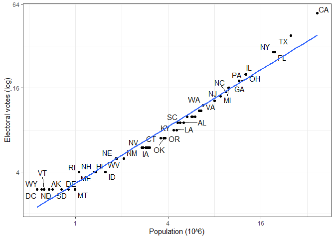

# HarvardX PH125.6x
Mauricio Matoma

# Data Science: Wrangling

## Section 1: Data import

### 1.1. Data Import

#### Paths and the Working Directory

``` r
library(dslabs)
```

Para conocer el directorio de trabajo, se utiliza la función getwd()
(funciona de manera similar a pwd de Unix).

``` r
getwd()
```

    [1] "D:/Documentos/R/HarvardX_PH125/PH125.6x/HarvardX_PH125.6x"

Se cambia la dirección de trabajo con setwd(). Para este caso, se
utilizarán datos dummy del paquete dslabs

``` r
path  <-  system.file("extdata", package = "dslabs")
list.files(path)
```

     [1] "2010_bigfive_regents.xls"                               
     [2] "calificaciones.csv"                                     
     [3] "carbon_emissions.csv"                                   
     [4] "fertility-two-countries-example.csv"                    
     [5] "HRlist2.txt"                                            
     [6] "life-expectancy-and-fertility-two-countries-example.csv"
     [7] "murders.csv"                                            
     [8] "olive.csv"                                              
     [9] "RD-Mortality-Report_2015-18-180531.pdf"                 
    [10] "ssa-death-probability.csv"                              

Extraer la ruta completa de un archivo a través de file.path()

``` r
filename <- "murders.csv"
fullpath <- file.path(path,filename)
fullpath
```

    [1] "C:/Users/matom/AppData/Local/R/win-library/4.3/dslabs/extdata/murders.csv"

Copiar el archivo dentro del proyecto

``` r
file.copy(fullpath, getwd())
```

    [1] FALSE

``` r
file.exists(filename)
```

    [1] TRUE

#### The readr and readxl Packages

La función read_lines() permite revisar los encabezados de un archivo,
por ejemplo:

``` r
library(readr)
read_lines("murders.csv", n_max=3)
```

    [1] "state,abb,region,population,total" "Alabama,AL,South,4779736,135"     
    [3] "Alaska,AK,West,710231,19"         

Leer el archivo:

``` r
dat <- read.csv("murders.csv")
head(dat)
```

           state abb region population total
    1    Alabama  AL  South    4779736   135
    2     Alaska  AK   West     710231    19
    3    Arizona  AZ   West    6392017   232
    4   Arkansas  AR  South    2915918    93
    5 California  CA   West   37253956  1257
    6   Colorado  CO   West    5029196    65

Leer datos con función de base R

``` r
dat2 <- read.csv(filename)
head(dat2)
```

           state abb region population total
    1    Alabama  AL  South    4779736   135
    2     Alaska  AK   West     710231    19
    3    Arizona  AZ   West    6392017   232
    4   Arkansas  AR  South    2915918    93
    5 California  CA   West   37253956  1257
    6   Colorado  CO   West    5029196    65

``` r
class(dat2)
```

    [1] "data.frame"

#### Downloading Files from the Internet

La función read_csv() importa directamente los archivos a partir de una
url

``` r
url <- "https://raw.githubusercontent.com/rafalab/dslabs/master/inst/extdata/murders.csv"
dat <- read.csv(url)
```

Para tener un archivo local, se descarga el archivo

``` r
download.file(url, "murders.csv")
```

#### Assessment Part 2: Data Import

``` r
url <- "https://archive.ics.uci.edu/ml/machine-learning-databases/breast-cancer-wisconsin/wdbc.data"
data <- read_csv(url, col_names = FALSE)
head(data)
```

    # A tibble: 6 × 32
           X1 X2       X3    X4    X5    X6     X7     X8     X9    X10   X11    X12
        <dbl> <chr> <dbl> <dbl> <dbl> <dbl>  <dbl>  <dbl>  <dbl>  <dbl> <dbl>  <dbl>
    1  8.42e5 M      18.0  10.4 123.  1001  0.118  0.278  0.300  0.147  0.242 0.0787
    2  8.43e5 M      20.6  17.8 133.  1326  0.0847 0.0786 0.0869 0.0702 0.181 0.0567
    3  8.43e7 M      19.7  21.2 130   1203  0.110  0.160  0.197  0.128  0.207 0.0600
    4  8.43e7 M      11.4  20.4  77.6  386. 0.142  0.284  0.241  0.105  0.260 0.0974
    5  8.44e7 M      20.3  14.3 135.  1297  0.100  0.133  0.198  0.104  0.181 0.0588
    6  8.44e5 M      12.4  15.7  82.6  477. 0.128  0.17   0.158  0.0809 0.209 0.0761
    # ℹ 20 more variables: X13 <dbl>, X14 <dbl>, X15 <dbl>, X16 <dbl>, X17 <dbl>,
    #   X18 <dbl>, X19 <dbl>, X20 <dbl>, X21 <dbl>, X22 <dbl>, X23 <dbl>,
    #   X24 <dbl>, X25 <dbl>, X26 <dbl>, X27 <dbl>, X28 <dbl>, X29 <dbl>,
    #   X30 <dbl>, X31 <dbl>, X32 <dbl>

``` r
nrow(data)
```

    [1] 569

``` r
ncol(data)
```

    [1] 32

## Section 2: Tidy Data

### 2.1. Reshaping Data

#### Tidy data

``` r
library(dslabs)
library(tidyverse)
path <- system.file("extdata", package = "dslabs")
filename <- file.path(path,"fertility-two-countries-example.csv")
wide_data <- read_csv(filename)
#View(wide_data)
```

``` r
select(wide_data, country, "1960":"1967")
```

    # A tibble: 2 × 9
      country     `1960` `1961` `1962` `1963` `1964` `1965` `1966` `1967`
      <chr>        <dbl>  <dbl>  <dbl>  <dbl>  <dbl>  <dbl>  <dbl>  <dbl>
    1 Germany       2.41   2.44   2.47   2.49   2.49   2.48   2.44   2.37
    2 South Korea   6.16   5.99   5.79   5.57   5.36   5.16   4.99   4.85

#### Reshaping data: pivot_longer

pivot longer utiliza dos argumentos. Primero, el data frame que será
modificado y el segundo argumento contiene las columnas de los valores a
mover.

Por ejemplo, se modificará de esta forma:

``` r
select(wide_data, country, "1960":"1967")
```

    # A tibble: 2 × 9
      country     `1960` `1961` `1962` `1963` `1964` `1965` `1966` `1967`
      <chr>        <dbl>  <dbl>  <dbl>  <dbl>  <dbl>  <dbl>  <dbl>  <dbl>
    1 Germany       2.41   2.44   2.47   2.49   2.49   2.48   2.44   2.37
    2 South Korea   6.16   5.99   5.79   5.57   5.36   5.16   4.99   4.85

A esta forma (nombre de las columnas a niveles de una variable en una
sola columna):

``` r
wide_data %>% pivot_longer("1960":"2015")
```

    # A tibble: 112 × 3
       country name  value
       <chr>   <chr> <dbl>
     1 Germany 1960   2.41
     2 Germany 1961   2.44
     3 Germany 1962   2.47
     4 Germany 1963   2.49
     5 Germany 1964   2.49
     6 Germany 1965   2.48
     7 Germany 1966   2.44
     8 Germany 1967   2.37
     9 Germany 1968   2.28
    10 Germany 1969   2.17
    # ℹ 102 more rows

Nótese que la información se modifica a nombres (years) y values
(fertility). Los podemos modificar de la siguiente forma:

``` r
new_tidy_data <- wide_data %>% 
  pivot_longer("1960":"2015", names_to = "year", values_to = "fertility")
head(new_tidy_data)
```

    # A tibble: 6 × 3
      country year  fertility
      <chr>   <chr>     <dbl>
    1 Germany 1960       2.41
    2 Germany 1961       2.44
    3 Germany 1962       2.47
    4 Germany 1963       2.49
    5 Germany 1964       2.49
    6 Germany 1965       2.48

Transformar la variable que aparece como caracter de la forma

``` r
new_tidy_data <- wide_data %>% 
  pivot_longer("1960":"2015", names_to = "year", values_to = "fertility") %>% mutate(year=as.numeric(year))
head(new_tidy_data)
```

    # A tibble: 6 × 3
      country  year fertility
      <chr>   <dbl>     <dbl>
    1 Germany  1960      2.41
    2 Germany  1961      2.44
    3 Germany  1962      2.47
    4 Germany  1963      2.49
    5 Germany  1964      2.49
    6 Germany  1965      2.48

O de la forma:

``` r
new_tidy_data <- wide_data %>% 
  pivot_longer("1960":"2015", names_to = "year", values_to = "fertility",
               names_transform = list(year=as.numeric))
head(new_tidy_data)
```

    # A tibble: 6 × 3
      country  year fertility
      <chr>   <dbl>     <dbl>
    1 Germany  1960      2.41
    2 Germany  1961      2.44
    3 Germany  1962      2.47
    4 Germany  1963      2.49
    5 Germany  1964      2.49
    6 Germany  1965      2.48

Finalmente, plotear:

``` r
new_tidy_data %>% ggplot(aes(year,fertility, color=country)) +
  geom_point() + geom_line() + theme_bw()
```


``` r
ggsave("images/plot.png")
```

#### Reshaping data: pivot wider

Función inversa de pivot_longer

names_from : Contiene los niveles de variable o filas que serán
transformadas en columnas

values_from: Contiene los valores deseados

``` r
new_wide_data <- new_tidy_data %>% 
  pivot_wider(names_from = year, values_from = fertility)
select(new_wide_data, country, "1960":"1967")
```

    # A tibble: 2 × 9
      country     `1960` `1961` `1962` `1963` `1964` `1965` `1966` `1967`
      <chr>        <dbl>  <dbl>  <dbl>  <dbl>  <dbl>  <dbl>  <dbl>  <dbl>
    1 Germany       2.41   2.44   2.47   2.49   2.49   2.48   2.44   2.37
    2 South Korea   6.16   5.99   5.79   5.57   5.36   5.16   4.99   4.85


#### Separate

``` r
path <- system.file("extdata", package="dslabs")
fname <- "life-expectancy-and-fertility-two-countries-example.csv"
filename <- file.path(path,fname)

raw_dat <- read_csv(filename)
#View(raw_dat)
select(raw_dat, 1:4)
```

    # A tibble: 2 × 4
      country     `1960_fertility` `1960_life_expectancy` `1961_fertility`
      <chr>                  <dbl>                  <dbl>            <dbl>
    1 Germany                 2.41                   69.3             2.44
    2 South Korea             6.16                   53.0             5.99

``` r
dat <- raw_dat %>% pivot_longer(-country)
head(dat)
```

    # A tibble: 6 × 3
      country name                 value
      <chr>   <chr>                <dbl>
    1 Germany 1960_fertility        2.41
    2 Germany 1960_life_expectancy 69.3 
    3 Germany 1961_fertility        2.44
    4 Germany 1961_life_expectancy 69.8 
    5 Germany 1962_fertility        2.47
    6 Germany 1962_life_expectancy 70.0 

La función separate() toma tres argumentos. El primero es el nombre de
la columna que será separada. El segundo el nombre para las nuevas
columnas y el tercero será el caracter que separa las variables

``` r
dat %>% separate(name, c("year", "name"), sep = "_")
```

    Warning: Expected 2 pieces. Additional pieces discarded in 112 rows [2, 4, 6, 8, 10, 12,
    14, 16, 18, 20, 22, 24, 26, 28, 30, 32, 34, 36, 38, 40, ...].

    # A tibble: 224 × 4
       country year  name      value
       <chr>   <chr> <chr>     <dbl>
     1 Germany 1960  fertility  2.41
     2 Germany 1960  life      69.3 
     3 Germany 1961  fertility  2.44
     4 Germany 1961  life      69.8 
     5 Germany 1962  fertility  2.47
     6 Germany 1962  life      70.0 
     7 Germany 1963  fertility  2.49
     8 Germany 1963  life      70.1 
     9 Germany 1964  fertility  2.49
    10 Germany 1964  life      70.7 
    # ℹ 214 more rows

Con el argumento convert = TRUE, se transforma automáticamente el año en
valor numérico

``` r
dat %>% separate(name, c("year", "name"), convert = TRUE)
```

    Warning: Expected 2 pieces. Additional pieces discarded in 112 rows [2, 4, 6, 8, 10, 12,
    14, 16, 18, 20, 22, 24, 26, 28, 30, 32, 34, 36, 38, 40, ...].

    # A tibble: 224 × 4
       country  year name      value
       <chr>   <int> <chr>     <dbl>
     1 Germany  1960 fertility  2.41
     2 Germany  1960 life      69.3 
     3 Germany  1961 fertility  2.44
     4 Germany  1961 life      69.8 
     5 Germany  1962 fertility  2.47
     6 Germany  1962 life      70.0 
     7 Germany  1963 fertility  2.49
     8 Germany  1963 life      70.1 
     9 Germany  1964 fertility  2.49
    10 Germany  1964 life      70.7 
    # ℹ 214 more rows

Se puede agregar otra columna para el “expectancy. Se llenarán algunos
valores nulos automáticamente (espacios fertility)

``` r
dat %>% separate(name, c("year", "name1", "name2"),
                 fill = "right" ,
                 convert = TRUE)
```

    # A tibble: 224 × 5
       country  year name1     name2      value
       <chr>   <int> <chr>     <chr>      <dbl>
     1 Germany  1960 fertility <NA>        2.41
     2 Germany  1960 life      expectancy 69.3 
     3 Germany  1961 fertility <NA>        2.44
     4 Germany  1961 life      expectancy 69.8 
     5 Germany  1962 fertility <NA>        2.47
     6 Germany  1962 life      expectancy 70.0 
     7 Germany  1963 fertility <NA>        2.49
     8 Germany  1963 life      expectancy 70.1 
     9 Germany  1964 fertility <NA>        2.49
    10 Germany  1964 life      expectancy 70.7 
    # ℹ 214 more rows

Sin embargo, es un mejor enfoque unir los nombres extra que se generen a
partir del argumento extra= “merge”

``` r
dat %>%  separate(name, c("year", "name"), sep="_",
                  extra = "merge", convert = TRUE)
```

    # A tibble: 224 × 4
       country  year name            value
       <chr>   <int> <chr>           <dbl>
     1 Germany  1960 fertility        2.41
     2 Germany  1960 life_expectancy 69.3 
     3 Germany  1961 fertility        2.44
     4 Germany  1961 life_expectancy 69.8 
     5 Germany  1962 fertility        2.47
     6 Germany  1962 life_expectancy 70.0 
     7 Germany  1963 fertility        2.49
     8 Germany  1963 life_expectancy 70.1 
     9 Germany  1964 fertility        2.49
    10 Germany  1964 life_expectancy 70.7 
    # ℹ 214 more rows

Finalmente, se separan los datos de fertility y life_expectancy en
columnas

``` r
dat %>% separate(name, c("year", "name"), sep = "_",
                 extra="merge", convert = TRUE) %>%
  pivot_wider()
```

    # A tibble: 112 × 4
       country  year fertility life_expectancy
       <chr>   <int>     <dbl>           <dbl>
     1 Germany  1960      2.41            69.3
     2 Germany  1961      2.44            69.8
     3 Germany  1962      2.47            70.0
     4 Germany  1963      2.49            70.1
     5 Germany  1964      2.49            70.7
     6 Germany  1965      2.48            70.6
     7 Germany  1966      2.44            70.8
     8 Germany  1967      2.37            71.0
     9 Germany  1968      2.28            70.6
    10 Germany  1969      2.17            70.5
    # ℹ 102 more rows

#### Unite

Función inversa de separate()

``` r
dat %>% 
  separate(name, c("year", "name1", "name2"),
           fill="right", convert = TRUE) %>% 
  unite(variable_name, name1, name2)
```

    # A tibble: 224 × 4
       country  year variable_name   value
       <chr>   <int> <chr>           <dbl>
     1 Germany  1960 fertility_NA     2.41
     2 Germany  1960 life_expectancy 69.3 
     3 Germany  1961 fertility_NA     2.44
     4 Germany  1961 life_expectancy 69.8 
     5 Germany  1962 fertility_NA     2.47
     6 Germany  1962 life_expectancy 70.0 
     7 Germany  1963 fertility_NA     2.49
     8 Germany  1963 life_expectancy 70.1 
     9 Germany  1964 fertility_NA     2.49
    10 Germany  1964 life_expectancy 70.7 
    # ℹ 214 more rows

Y finalmente, dispersar las columnas

``` r
dat %>% 
  separate(name, c("year", "name1", "name2"),
           fill="right", convert = TRUE) %>% #Separar 
  unite(name, name1, name2) %>% #Unir como un solo nombre
  spread(name, value) %>% #Spread() sirve como pivot_wide() 
  rename(fertility = fertility_NA)
```

    # A tibble: 112 × 4
       country  year fertility life_expectancy
       <chr>   <int>     <dbl>           <dbl>
     1 Germany  1960      2.41            69.3
     2 Germany  1961      2.44            69.8
     3 Germany  1962      2.47            70.0
     4 Germany  1963      2.49            70.1
     5 Germany  1964      2.49            70.7
     6 Germany  1965      2.48            70.6
     7 Germany  1966      2.44            70.8
     8 Germany  1967      2.37            71.0
     9 Germany  1968      2.28            70.6
    10 Germany  1969      2.17            70.5
    # ℹ 102 more rows

Guardar como RDS

``` r
data_final <- dat %>% 
  separate(name, c("year", "name1", "name2"),
           fill="right", convert = TRUE) %>% #Separar 
  unite(name, name1, name2) %>% #Unir como un solo nombre
  spread(name, value) %>% #Spread() sirve como pivot_wide() 
  rename(fertility = fertility_NA)
saveRDS(data_final, "data/data_final.rds")
```

#### Assessment Part 2: Reshaping Data

``` r
library(tidyverse)
library(dslabs)
```

``` r
co2
```

            Jan    Feb    Mar    Apr    May    Jun    Jul    Aug    Sep    Oct
    1959 315.42 316.31 316.50 317.56 318.13 318.00 316.39 314.65 313.68 313.18
    1960 316.27 316.81 317.42 318.87 319.87 319.43 318.01 315.74 314.00 313.68
    1961 316.73 317.54 318.38 319.31 320.42 319.61 318.42 316.63 314.83 315.16
    1962 317.78 318.40 319.53 320.42 320.85 320.45 319.45 317.25 316.11 315.27
    1963 318.58 318.92 319.70 321.22 322.08 321.31 319.58 317.61 316.05 315.83
    1964 319.41 320.07 320.74 321.40 322.06 321.73 320.27 318.54 316.54 316.71
    1965 319.27 320.28 320.73 321.97 322.00 321.71 321.05 318.71 317.66 317.14
    1966 320.46 321.43 322.23 323.54 323.91 323.59 322.24 320.20 318.48 317.94
    1967 322.17 322.34 322.88 324.25 324.83 323.93 322.38 320.76 319.10 319.24
    1968 322.40 322.99 323.73 324.86 325.40 325.20 323.98 321.95 320.18 320.09
    1969 323.83 324.26 325.47 326.50 327.21 326.54 325.72 323.50 322.22 321.62
    1970 324.89 325.82 326.77 327.97 327.91 327.50 326.18 324.53 322.93 322.90
    1971 326.01 326.51 327.01 327.62 328.76 328.40 327.20 325.27 323.20 323.40
    1972 326.60 327.47 327.58 329.56 329.90 328.92 327.88 326.16 324.68 325.04
    1973 328.37 329.40 330.14 331.33 332.31 331.90 330.70 329.15 327.35 327.02
    1974 329.18 330.55 331.32 332.48 332.92 332.08 331.01 329.23 327.27 327.21
    1975 330.23 331.25 331.87 333.14 333.80 333.43 331.73 329.90 328.40 328.17
    1976 331.58 332.39 333.33 334.41 334.71 334.17 332.89 330.77 329.14 328.78
    1977 332.75 333.24 334.53 335.90 336.57 336.10 334.76 332.59 331.42 330.98
    1978 334.80 335.22 336.47 337.59 337.84 337.72 336.37 334.51 332.60 332.38
    1979 336.05 336.59 337.79 338.71 339.30 339.12 337.56 335.92 333.75 333.70
    1980 337.84 338.19 339.91 340.60 341.29 341.00 339.39 337.43 335.72 335.84
    1981 339.06 340.30 341.21 342.33 342.74 342.08 340.32 338.26 336.52 336.68
    1982 340.57 341.44 342.53 343.39 343.96 343.18 341.88 339.65 337.81 337.69
    1983 341.20 342.35 342.93 344.77 345.58 345.14 343.81 342.21 339.69 339.82
    1984 343.52 344.33 345.11 346.88 347.25 346.62 345.22 343.11 340.90 341.18
    1985 344.79 345.82 347.25 348.17 348.74 348.07 346.38 344.51 342.92 342.62
    1986 346.11 346.78 347.68 349.37 350.03 349.37 347.76 345.73 344.68 343.99
    1987 347.84 348.29 349.23 350.80 351.66 351.07 349.33 347.92 346.27 346.18
    1988 350.25 351.54 352.05 353.41 354.04 353.62 352.22 350.27 348.55 348.72
    1989 352.60 352.92 353.53 355.26 355.52 354.97 353.75 351.52 349.64 349.83
    1990 353.50 354.55 355.23 356.04 357.00 356.07 354.67 352.76 350.82 351.04
    1991 354.59 355.63 357.03 358.48 359.22 358.12 356.06 353.92 352.05 352.11
    1992 355.88 356.63 357.72 359.07 359.58 359.17 356.94 354.92 352.94 353.23
    1993 356.63 357.10 358.32 359.41 360.23 359.55 357.53 355.48 353.67 353.95
    1994 358.34 358.89 359.95 361.25 361.67 360.94 359.55 357.49 355.84 356.00
    1995 359.98 361.03 361.66 363.48 363.82 363.30 361.94 359.50 358.11 357.80
    1996 362.09 363.29 364.06 364.76 365.45 365.01 363.70 361.54 359.51 359.65
    1997 363.23 364.06 364.61 366.40 366.84 365.68 364.52 362.57 360.24 360.83
            Nov    Dec
    1959 314.66 315.43
    1960 314.84 316.03
    1961 315.94 316.85
    1962 316.53 317.53
    1963 316.91 318.20
    1964 317.53 318.55
    1965 318.70 319.25
    1966 319.63 320.87
    1967 320.56 321.80
    1968 321.16 322.74
    1969 322.69 323.95
    1970 323.85 324.96
    1971 324.63 325.85
    1972 326.34 327.39
    1973 327.99 328.48
    1974 328.29 329.41
    1975 329.32 330.59
    1976 330.14 331.52
    1977 332.24 333.68
    1978 333.75 334.78
    1979 335.12 336.56
    1980 336.93 338.04
    1981 338.19 339.44
    1982 339.09 340.32
    1983 340.98 342.82
    1984 342.80 344.04
    1985 344.06 345.38
    1986 345.48 346.72
    1987 347.64 348.78
    1988 349.91 351.18
    1989 351.14 352.37
    1990 352.69 354.07
    1991 353.64 354.89
    1992 354.09 355.33
    1993 355.30 356.78
    1994 357.59 359.05
    1995 359.61 360.74
    1996 360.80 362.38
    1997 362.49 364.34

``` r
#View(co2)
head(co2)
```

    [1] 315.42 316.31 316.50 317.56 318.13 318.00

``` r
co2_wide <- data.frame(matrix(co2, ncol = 12, byrow = TRUE)) %>% 
    setNames(1:12) %>%
    mutate(year = as.character(1959:1997))
#View(co2_wide)
```

``` r
co2_tidy <- pivot_longer(co2_wide, -year, names_to = "month", values_to = "co2")
#View(co2_tidy)
```

``` r
co2_tidy %>% ggplot(aes(as.numeric(month), co2, color = year)) + geom_line() + theme_bw() + xlab("Month")
```


``` r
ggsave("images/graf2.png")
```

``` r
library(dslabs)
data("admissions")
dat <- admissions %>% select(-applicants)
#View(dat)
```

``` r
dat_tidy <- pivot_wider(dat, names_from = gender, values_from = admitted)
dat_tidy
```

    # A tibble: 6 × 3
      major   men women
      <chr> <dbl> <dbl>
    1 A        62    82
    2 B        63    68
    3 C        37    34
    4 D        33    35
    5 E        28    24
    6 F         6     7

``` r
tmp <- admissions %>%
  pivot_longer(cols = c(admitted, applicants), names_to = "key", values_to = "value")
tmp
```

    # A tibble: 24 × 4
       major gender key        value
       <chr> <chr>  <chr>      <dbl>
     1 A     men    admitted      62
     2 A     men    applicants   825
     3 B     men    admitted      63
     4 B     men    applicants   560
     5 C     men    admitted      37
     6 C     men    applicants   325
     7 D     men    admitted      33
     8 D     men    applicants   417
     9 E     men    admitted      28
    10 E     men    applicants   191
    # ℹ 14 more rows

``` r
tmp2 <- unite(tmp, column_name, c(key, gender))
tmp2
```

    # A tibble: 24 × 3
       major column_name    value
       <chr> <chr>          <dbl>
     1 A     admitted_men      62
     2 A     applicants_men   825
     3 B     admitted_men      63
     4 B     applicants_men   560
     5 C     admitted_men      37
     6 C     applicants_men   325
     7 D     admitted_men      33
     8 D     applicants_men   417
     9 E     admitted_men      28
    10 E     applicants_men   191
    # ℹ 14 more rows

``` r
tmp2 <- unite(tmp, column_name, c(key, gender)) 
tmp2
```

    # A tibble: 24 × 3
       major column_name    value
       <chr> <chr>          <dbl>
     1 A     admitted_men      62
     2 A     applicants_men   825
     3 B     admitted_men      63
     4 B     applicants_men   560
     5 C     admitted_men      37
     6 C     applicants_men   325
     7 D     admitted_men      33
     8 D     applicants_men   417
     9 E     admitted_men      28
    10 E     applicants_men   191
    # ℹ 14 more rows

## Section 2: Tidy Data

### 2.2. Combining Tables

#### Combining Tables

``` r
library(dslabs)
library(tidyverse)
library(ggrepel)
data(murders)
#View(murders)
data(results_us_election_2016)
#View(results_us_election_2016)
#Ordenar datos por orden alfabético de state a través de arrange
results_us_election_2016 <- results_us_election_2016 %>% arrange(state)
```

Por medio de la función left_join, es posible unir tablas por una
variable en común. En este caso, la variable state:

``` r
tab <- left_join(murders, results_us_election_2016, by="state")
head(tab)
```

           state abb region population total electoral_votes clinton trump others
    1    Alabama  AL  South    4779736   135               9    34.4  62.1    3.6
    2     Alaska  AK   West     710231    19               3    36.6  51.3   12.2
    3    Arizona  AZ   West    6392017   232              11    45.1  48.7    6.2
    4   Arkansas  AR  South    2915918    93               6    33.7  60.6    5.8
    5 California  CA   West   37253956  1257              55    61.7  31.6    6.7
    6   Colorado  CO   West    5029196    65               9    48.2  43.3    8.6

``` r
#View(tab)
```

Graficar

``` r
tab %>% ggplot(aes(population/10^6, electoral_votes, label=abb)) +
  geom_point()+
  geom_text_repel()+
  scale_x_continuous(trans = "log2") +
  scale_y_continuous(trans= "log2") +
  geom_smooth(method = "lm", se=FALSE) +
  xlab("Population (10^6)")+
  ylab("Electoral votes (log)")+
  theme_bw()
```



``` r
ggsave("images/plot2.png")
```

Otro ejemplo

``` r
tab1 <- slice(murders, 1:6) %>% select(state,population)
tab1
```

           state population
    1    Alabama    4779736
    2     Alaska     710231
    3    Arizona    6392017
    4   Arkansas    2915918
    5 California   37253956
    6   Colorado    5029196

``` r
tab2 <- slice(results_us_election_2016, c(1:3, 5, 7:8)) %>% 
  select(state,electoral_votes)
tab2
```

            state electoral_votes
    1     Alabama               9
    2      Alaska               3
    3     Arizona              11
    4  California              55
    5 Connecticut               7
    6    Delaware               3

``` r
left_join(tab1, tab2)
```

           state population electoral_votes
    1    Alabama    4779736               9
    2     Alaska     710231               3
    3    Arizona    6392017              11
    4   Arkansas    2915918              NA
    5 California   37253956              55
    6   Colorado    5029196              NA

Otras formas de unir:

``` r
tab1 %>% left_join(tab2)
```

           state population electoral_votes
    1    Alabama    4779736               9
    2     Alaska     710231               3
    3    Arizona    6392017              11
    4   Arkansas    2915918              NA
    5 California   37253956              55
    6   Colorado    5029196              NA

``` r
tab1 %>% right_join(tab2)
```

            state population electoral_votes
    1     Alabama    4779736               9
    2      Alaska     710231               3
    3     Arizona    6392017              11
    4  California   37253956              55
    5 Connecticut         NA               7
    6    Delaware         NA               3

Si quiero conservar sólo las filas que tienen información en ambas
tablas, utilizo inner_join()

``` r
inner_join(tab1, tab2)
```

           state population electoral_votes
    1    Alabama    4779736               9
    2     Alaska     710231               3
    3    Arizona    6392017              11
    4 California   37253956              55

Si quiero conservar todas las filas, aunque tengan valores nulos,
utilizo full_join()

``` r
full_join(tab1,tab2)
```

            state population electoral_votes
    1     Alabama    4779736               9
    2      Alaska     710231               3
    3     Arizona    6392017              11
    4    Arkansas    2915918              NA
    5  California   37253956              55
    6    Colorado    5029196              NA
    7 Connecticut         NA               7
    8    Delaware         NA               3

La función semi_join() conserva la información de la tabla 1 que también
está en la tabla 2

``` r
semi_join(tab1, tab2)
```

           state population
    1    Alabama    4779736
    2     Alaska     710231
    3    Arizona    6392017
    4 California   37253956

La función anti_join() conserva la información de la tabla 1 que no está
en la tabla 2. Es una función inversa de semi_join()

``` r
anti_join(tab1,tab2)
```

         state population
    1 Arkansas    2915918
    2 Colorado    5029196

#### Binding

La función bind_cols() combina tablas por columnas sin importar las
variables en común

``` r
bind_cols(a=1:3,b=4:6)
```

    # A tibble: 3 × 2
          a     b
      <int> <int>
    1     1     4
    2     2     5
    3     3     6

También sirve para concatenar data frames

``` r
tab1 <- tab[,1:3]
tab2 <- tab[,4:6]
tab3 <- tab[,7:9]
new_tab <- bind_cols(tab1,tab2,tab3)
head(new_tab)
```

           state abb region population total electoral_votes clinton trump others
    1    Alabama  AL  South    4779736   135               9    34.4  62.1    3.6
    2     Alaska  AK   West     710231    19               3    36.6  51.3   12.2
    3    Arizona  AZ   West    6392017   232              11    45.1  48.7    6.2
    4   Arkansas  AR  South    2915918    93               6    33.7  60.6    5.8
    5 California  CA   West   37253956  1257              55    61.7  31.6    6.7
    6   Colorado  CO   West    5029196    65               9    48.2  43.3    8.6

bind_rows() funciona de manera similar, pero concatenando filas

``` r
tab1 <- tab[1:2,]
tab2 <- tab[3:4,]
bind_rows(tab1, tab2)
```

         state abb region population total electoral_votes clinton trump others
    1  Alabama  AL  South    4779736   135               9    34.4  62.1    3.6
    2   Alaska  AK   West     710231    19               3    36.6  51.3   12.2
    3  Arizona  AZ   West    6392017   232              11    45.1  48.7    6.2
    4 Arkansas  AR  South    2915918    93               6    33.7  60.6    5.8

#### Set operators

Intersect() aplica para vectores y para data frames

``` r
intersect(1:10, 6:15)
```

    [1]  6  7  8  9 10

``` r
head(tab,7)
```

            state abb    region population total electoral_votes clinton trump
    1     Alabama  AL     South    4779736   135               9    34.4  62.1
    2      Alaska  AK      West     710231    19               3    36.6  51.3
    3     Arizona  AZ      West    6392017   232              11    45.1  48.7
    4    Arkansas  AR     South    2915918    93               6    33.7  60.6
    5  California  CA      West   37253956  1257              55    61.7  31.6
    6    Colorado  CO      West    5029196    65               9    48.2  43.3
    7 Connecticut  CT Northeast    3574097    97               7    54.6  40.9
      others
    1    3.6
    2   12.2
    3    6.2
    4    5.8
    5    6.7
    6    8.6
    7    4.5

``` r
tab1 <- tab[1:5,]
tab1
```

           state abb region population total electoral_votes clinton trump others
    1    Alabama  AL  South    4779736   135               9    34.4  62.1    3.6
    2     Alaska  AK   West     710231    19               3    36.6  51.3   12.2
    3    Arizona  AZ   West    6392017   232              11    45.1  48.7    6.2
    4   Arkansas  AR  South    2915918    93               6    33.7  60.6    5.8
    5 California  CA   West   37253956  1257              55    61.7  31.6    6.7

``` r
tab2 <- tab[3:7,]
tab2
```

            state abb    region population total electoral_votes clinton trump
    3     Arizona  AZ      West    6392017   232              11    45.1  48.7
    4    Arkansas  AR     South    2915918    93               6    33.7  60.6
    5  California  CA      West   37253956  1257              55    61.7  31.6
    6    Colorado  CO      West    5029196    65               9    48.2  43.3
    7 Connecticut  CT Northeast    3574097    97               7    54.6  40.9
      others
    3    6.2
    4    5.8
    5    6.7
    6    8.6
    7    4.5

``` r
intersect(tab1, tab2)
```

           state abb region population total electoral_votes clinton trump others
    1    Arizona  AZ   West    6392017   232              11    45.1  48.7    6.2
    2   Arkansas  AR  South    2915918    93               6    33.7  60.6    5.8
    3 California  CA   West   37253956  1257              55    61.7  31.6    6.7

Unión funciona similar para vectores y data frames

``` r
union(c("a","b","c"), c("b","c","d"))
```

    [1] "a" "b" "c" "d"

``` r
head(tab,7)
```

            state abb    region population total electoral_votes clinton trump
    1     Alabama  AL     South    4779736   135               9    34.4  62.1
    2      Alaska  AK      West     710231    19               3    36.6  51.3
    3     Arizona  AZ      West    6392017   232              11    45.1  48.7
    4    Arkansas  AR     South    2915918    93               6    33.7  60.6
    5  California  CA      West   37253956  1257              55    61.7  31.6
    6    Colorado  CO      West    5029196    65               9    48.2  43.3
    7 Connecticut  CT Northeast    3574097    97               7    54.6  40.9
      others
    1    3.6
    2   12.2
    3    6.2
    4    5.8
    5    6.7
    6    8.6
    7    4.5

``` r
tab1 <- tab[1:5,]
tab2 <- tab[3:7,]
union(tab1,tab2)
```

            state abb    region population total electoral_votes clinton trump
    1     Alabama  AL     South    4779736   135               9    34.4  62.1
    2      Alaska  AK      West     710231    19               3    36.6  51.3
    3     Arizona  AZ      West    6392017   232              11    45.1  48.7
    4    Arkansas  AR     South    2915918    93               6    33.7  60.6
    5  California  CA      West   37253956  1257              55    61.7  31.6
    6    Colorado  CO      West    5029196    65               9    48.2  43.3
    7 Connecticut  CT Northeast    3574097    97               7    54.6  40.9
      others
    1    3.6
    2   12.2
    3    6.2
    4    5.8
    5    6.7
    6    8.6
    7    4.5

La función setdiff() permite encontrar todas las filas de x que no están
en y. Por lo tanto, el orden de los argumentos importa.

``` r
setdiff(1:10,6:15)
```

    [1] 1 2 3 4 5

``` r
setdiff(6:15,1:10) 
```

    [1] 11 12 13 14 15

``` r
head(tab,7)
```

            state abb    region population total electoral_votes clinton trump
    1     Alabama  AL     South    4779736   135               9    34.4  62.1
    2      Alaska  AK      West     710231    19               3    36.6  51.3
    3     Arizona  AZ      West    6392017   232              11    45.1  48.7
    4    Arkansas  AR     South    2915918    93               6    33.7  60.6
    5  California  CA      West   37253956  1257              55    61.7  31.6
    6    Colorado  CO      West    5029196    65               9    48.2  43.3
    7 Connecticut  CT Northeast    3574097    97               7    54.6  40.9
      others
    1    3.6
    2   12.2
    3    6.2
    4    5.8
    5    6.7
    6    8.6
    7    4.5

``` r
tab1 <- tab[1:5,]
tab2 <- tab[3:7,]
setdiff(tab1,tab2)
```

        state abb region population total electoral_votes clinton trump others
    1 Alabama  AL  South    4779736   135               9    34.4  62.1    3.6
    2  Alaska  AK   West     710231    19               3    36.6  51.3   12.2

Por último, la función setequal() returna TRUE si x y y contienen las
mismas filas sin importar el orden:

``` r
setequal(1:5, 1:6)
```

    [1] FALSE

``` r
setequal(1:5,5:1)
```

    [1] TRUE

``` r
setequal(tab1, tab2)
```

    [1] FALSE

#### Assessment: Combining Tables

``` r
library(Lahman)
library(writexl)
#View(Batting)
top <- Batting %>%
  filter(yearID==2016) %>% 
  arrange(desc(HR)) %>% #arrange by descending HR count
  slice(1:10)  #Take entries 1:10
top %>% as_tibble()
```

    # A tibble: 10 × 22
       playerID  yearID stint teamID lgID      G    AB     R     H   X2B   X3B    HR
       <chr>      <int> <int> <fct>  <fct> <int> <int> <int> <int> <int> <int> <int>
     1 trumbma01   2016     1 BAL    AL      159   613    94   157    27     1    47
     2 cruzne02    2016     1 SEA    AL      155   589    96   169    27     1    43
     3 daviskh01   2016     1 OAK    AL      150   555    85   137    24     2    42
     4 doziebr01   2016     1 MIN    AL      155   615   104   165    35     5    42
     5 encared01   2016     1 TOR    AL      160   601    99   158    34     0    42
     6 arenano01   2016     1 COL    NL      160   618   116   182    35     6    41
     7 cartech02   2016     1 MIL    NL      160   549    84   122    27     1    41
     8 frazito01   2016     1 CHA    AL      158   590    89   133    21     0    40
     9 bryankr01   2016     1 CHN    NL      155   603   121   176    35     3    39
    10 canoro01    2016     1 SEA    AL      161   655   107   195    33     2    39
    # ℹ 10 more variables: RBI <int>, SB <int>, CS <int>, BB <int>, SO <int>,
    #   IBB <int>, HBP <int>, SH <int>, SF <int>, GIDP <int>

Revisar el data frame People, que tiene información demográfica de todos
los jugadores

``` r
People %>% as_tibble()
```

    # A tibble: 21,010 × 26
       playerID  birthYear birthMonth birthDay birthCity    birthCountry birthState
       <chr>         <int>      <int>    <int> <chr>        <chr>        <chr>     
     1 aardsda01      1981         12       27 Denver       USA          CO        
     2 aaronha01      1934          2        5 Mobile       USA          AL        
     3 aaronto01      1939          8        5 Mobile       USA          AL        
     4 aasedo01       1954          9        8 Orange       USA          CA        
     5 abadan01       1972          8       25 Palm Beach   USA          FL        
     6 abadfe01       1985         12       17 La Romana    D.R.         La Romana 
     7 abadijo01      1850         11        4 Philadelphia USA          PA        
     8 abbated01      1877          4       15 Latrobe      USA          PA        
     9 abbeybe01      1869         11       11 Essex        USA          VT        
    10 abbeych01      1866         10       14 Falls City   USA          NE        
    # ℹ 21,000 more rows
    # ℹ 19 more variables: deathYear <int>, deathMonth <int>, deathDay <int>,
    #   deathCountry <chr>, deathState <chr>, deathCity <chr>, nameFirst <chr>,
    #   nameLast <chr>, nameGiven <chr>, weight <int>, height <int>, bats <fct>,
    #   throws <fct>, debut <chr>, bbrefID <chr>, finalGame <chr>, retroID <chr>,
    #   deathDate <date>, birthDate <date>

``` r
#View(People)
```

Vincular información al top 10:

``` r
top_names <- top %>%
  left_join(People) %>% 
  select(playerID,nameFirst, nameLast, HR)
top_names
```

        playerID nameFirst    nameLast HR
    1  trumbma01      Mark      Trumbo 47
    2   cruzne02    Nelson        Cruz 43
    3  daviskh01     Khris       Davis 42
    4  doziebr01     Brian      Dozier 42
    5  encared01     Edwin Encarnacion 42
    6  arenano01     Nolan     Arenado 41
    7  cartech02     Chris      Carter 41
    8  frazito01      Todd     Frazier 40
    9  bryankr01      Kris      Bryant 39
    10  canoro01  Robinson        Cano 39

``` r
#View(top_names)
saveRDS(top_names, "data/top_names.rds")
write_csv(top_names, "data/top_names.csv")
write_rds(top_names, "data/top_names2.rds")
```

#### Question 6

Inspect the `Salaries` data frame. Filter this data frame to the 2016
salaries, then use the correct bind join function to add
a `salary` column to the `top_names` data frame from the previous
question. Name the new data frame `top_salary`. Use this code framework:

``` r
#View(Salaries)
top_salaries <- Salaries %>%
  filter(yearID==2016) %>% 
  right_join(top_names)
top_salaries
```

       yearID teamID lgID  playerID   salary nameFirst    nameLast HR
    1    2016    BAL   AL trumbma01  9150000      Mark      Trumbo 47
    2    2016    CHA   AL frazito01  8250000      Todd     Frazier 40
    3    2016    CHN   NL bryankr01   652000      Kris      Bryant 39
    4    2016    COL   NL arenano01  5000000     Nolan     Arenado 41
    5    2016    MIL   NL cartech02  2500000     Chris      Carter 41
    6    2016    MIN   AL doziebr01  3000000     Brian      Dozier 42
    7    2016    OAK   AL daviskh01   524500     Khris       Davis 42
    8    2016    SEA   AL  canoro01 24000000  Robinson        Cano 39
    9    2016    SEA   AL  cruzne02 14250000    Nelson        Cruz 43
    10   2016    TOR   AL encared01 10000000     Edwin Encarnacion 42

``` r
write_xlsx(top_salaries, "data/top_salaries.xlsx")
```

#### Question 7

Inspect the `AwardsPlayers` table. Filter awards to include only the
year 2016.

How many players from the top 10 home run hitters won at least one award
in 2016?

``` r
#View(AwardsPlayers)
AwardsPlayers_2016 <- AwardsPlayers %>% 
  filter(yearID==2016) 
top_names %>% left_join(AwardsPlayers_2016)
```

        playerID nameFirst    nameLast HR              awardID yearID lgID  tie
    1  trumbma01      Mark      Trumbo 47       Silver Slugger   2016   AL <NA>
    2   cruzne02    Nelson        Cruz 43                 <NA>     NA <NA> <NA>
    3  daviskh01     Khris       Davis 42                 <NA>     NA <NA> <NA>
    4  doziebr01     Brian      Dozier 42                 <NA>     NA <NA> <NA>
    5  encared01     Edwin Encarnacion 42                 <NA>     NA <NA> <NA>
    6  arenano01     Nolan     Arenado 41       Silver Slugger   2016   NL <NA>
    7  arenano01     Nolan     Arenado 41           Gold Glove   2016   NL <NA>
    8  cartech02     Chris      Carter 41                 <NA>     NA <NA> <NA>
    9  frazito01      Todd     Frazier 40                 <NA>     NA <NA> <NA>
    10 bryankr01      Kris      Bryant 39 Most Valuable Player   2016   NL <NA>
    11 bryankr01      Kris      Bryant 39     Hank Aaron Award   2016   NL <NA>
    12 bryankr01      Kris      Bryant 39         TSN All-Star   2016   NL <NA>
    13  canoro01  Robinson        Cano 39                 <NA>     NA <NA> <NA>
       notes
    1     OF
    2   <NA>
    3   <NA>
    4   <NA>
    5   <NA>
    6     3B
    7     3B
    8   <NA>
    9   <NA>
    10  <NA>
    11    3B
    12    3B
    13  <NA>

How many players won an award in 2016 but were not one of the top 10
home run hitters in 2016?

``` r
dat_awa <- AwardsPlayers_2016 %>%
  anti_join(top_names) %>% 
  select(playerID) %>% 
  unique()
dat_awa
```

        playerID
    1  altuvjo01
    2  rizzoan01
    3  lindofr01
    4  hosmeer01
    5  lestejo01
    6  mcgowdu01
    7  perezsa02
    8  cabremi01
    10 donaljo02
    11 bogaexa01
    12 bettsmo01
    13 troutmi01
    14 ortizda01
    15 ramoswi01
    17 murphda08
    18 seageco01
    19 blackch02
    20 cespeyo01
    21 yelicch01
    22 arrieja01
    24 morelmi01
    25 kinslia01
    26 beltrad01
    28 gardnbr01
    29 kiermke01
    31 keuchda01
    32 poseybu01
    34 panikjo01
    35 crawfbr01
    36 martest01
    37 inciaen01
    38 heywaja01
    39 greinza01
    41 porceri01
    42 scherma01
    43 fulmemi01
    45 grandcu01
    47 zobribe01
    48 millean01
    49  baezja01
    52 rendoan01
    54 brittza01
    55 janseke01
    58 klubeco01
    62 freemfr01
    77 bradlja02

Otras formas de resolver los ejercicios:

``` r
Awards_2016 <- AwardsPlayers %>% filter(yearID == 2016)
length(intersect(Awards_2016$playerID, top_names$playerID))
```

    [1] 3

``` r
length(setdiff(Awards_2016$playerID, top_names$playerID))
```

    [1] 46

#### 2.3. Web Scraping

El paquete rvest (incluído dentro de tidyverse), permite extraer
información de páginas web (formato html y xml). Esto es posible a
través de la función html_table()

``` r
library(rvest)
```

    Warning: package 'rvest' was built under R version 4.3.3

``` r
url <- "https://en.wikipedia.org/wiki/Murder_in_the_United_States_by_state"
h <- read_html(url)
class(h)
```

    [1] "xml_document" "xml_node"    

``` r
h
```

    {html_document}
    <html class="client-nojs vector-feature-language-in-header-enabled vector-feature-language-in-main-page-header-disabled vector-feature-page-tools-pinned-disabled vector-feature-toc-pinned-clientpref-1 vector-feature-main-menu-pinned-disabled vector-feature-limited-width-clientpref-1 vector-feature-limited-width-content-enabled vector-feature-custom-font-size-clientpref-1 vector-feature-appearance-pinned-clientpref-1 vector-feature-night-mode-enabled skin-theme-clientpref-day vector-sticky-header-enabled vector-toc-available" lang="en" dir="ltr">
    [1] <head>\n<meta http-equiv="Content-Type" content="text/html; charset=UTF-8 ...
    [2] <body class="skin--responsive skin-vector skin-vector-search-vue mediawik ...

Se utiliza la función html_nodes() para extraer elementos de la página,
en este caso table. Revisar sus propiedades y extraer la tabla 2

``` r
tab <- h %>% html_nodes("table")
tab <- tab[[2]]
tab
```

    {html_node}
    <table class="wikitable sortable sticky-header static-row-numbers sort-under col1left" style="text-align:right">
    [1] <caption>Gun deaths by intent\n</caption>
    [2] <tbody>\n<tr>\n<th>State</th>\n<th>Gun <br> deaths</th>\n<th>Suicide</th> ...

Y se utiliza la función html_table() para convertir en data frame

``` r
tab <- tab %>% html_table()
head(tab)
```

    # A tibble: 6 × 6
      State         `Gun  deaths` Suicide Homicide Accident   Law
      <chr>         <chr>         <chr>   <chr>       <int> <int>
    1 United States 48,830        26,328  20,958        549   537
    2 Texas         4,613         2,528   1,942          53    38
    3 California    3,576         1,575   1,861          32    89
    4 Florida       3,142         1,928   1,150          18    25
    5 Georgia       2,200         1,115   1,021          25    22
    6 Illinois      1,995         656     1,292          15    18

#### Assessment: Web Scraping

``` r
library(rvest)
url <- "https://web.archive.org/web/20181024132313/http://www.stevetheump.com/Payrolls.htm"
h <- read_html(url)
```

We learned that tables in html are associated with the `table` node. 
Use the `html_nodes()` function and the `table` node type to extract the
first table. Store it in an object `nodes`:

``` r
nodes <- html_nodes(h, "table")
```

The `html_nodes()` function returns a list of objects of
class `xml_node`. We can see the content of each one using, for example,
the `html_text()` function. You can see the content for an arbitrarily
picked component like this:

``` r
html_text(nodes[[8]])
```

    [1] "Team\nPayroll\nAverge\nMedianNew York Yankees\n$ 197,962,289\n$ 6,186,321\n$ 1,937,500Philadelphia Phillies\n$ 174,538,938\n$ 5,817,964\n$ 1,875,000Boston Red Sox\n$ 173,186,617\n$ 5,093,724\n$ 1,556,250Los Angeles Angels\n$ 154,485,166\n$ 5,327,074\n$ 3,150,000Detroit Tigers\n$ 132,300,000\n$ 4,562,068\n$ 1,100,000Texas Rangers\n$ 120,510,974\n$ 4,635,037\n$ 3,437,500Miami Marlins\n$ 118,078,000\n$ 4,373,259\n$ 1,500,000San Francisco Giants\n$ 117,620,683\n$ 3,920,689\n$ 1,275,000St. Louis Cardinals\n$ 110,300,862\n$ 3,939,316\n$ 800,000Milwaukee Brewers\n$ 97,653,944\n$ 3,755,920\n$ 1,981,250Chicago White Sox\n$ 96,919,500\n$ 3,876,780\n$ 530,000Los Angeles Dodgers\n$ 95,143,575\n$ 3,171,452\n$ 875,000Minnesota Twins\n$ 94,085,000\n$ 3,484,629\n$ 750,000New York Mets\n$ 93,353,983\n$ 3,457,554\n$ 875,000Chicago Cubs\n$ 88,197,033\n$ 3,392,193\n$ 1,262,500Atlanta Braves\n$ 83,309,942\n$ 2,776,998\n$ 577,500Cincinnati Reds\n$ 82,203,616\n$ 2,935,843\n$ 1,150,000Seattle Mariners\n$ 81,978,100\n$ 2,927,789\n$ 495,150Baltimore Orioles\n$ 81,428,999\n$ 2,807,896\n$ 1,300,000Washington Nationals\n$ 81,336,143\n$ 2,623,746\n$ 800,000Cleveland Indians\n$ 78,430,300\n$ 2,704,493\n$ 800,000Colorado Rockies\n$ 78,069,571\n$ 2,692,054\n$ 482,000Toronto Blue Jays\n$ 75,489,200\n$ 2,696,042\n$ 1,768,750Arizona Diamondbacks\n$ 74,284,833\n$ 2,653,029\n$ 1,625,000Tampa Bay Rays\n$ 64,173,500\n$ 2,291,910\n$ 1,425,000Pittsburgh Pirates\n$ 63,431,999\n$ 2,187,310\n$ 916,666Kansas City Royals\n$ 60,916,225\n$ 2,030,540\n$ 870,000Houston Astros\n$ 60,651,000\n$ 2,332,730\n$ 491,250Oakland Athletics\n$ 55,372,500\n$ 1,845,750\n$ 487,500San Diego Padres\n$ 55,244,700\n$ 1,973,025\n$ 1,207,500"

If the content of this object is an html table, we can use
the `html_table()` function to convert it to a data frame:

``` r
tab1 <- html_table(nodes[[8]])
```

``` r
html_table(nodes[[8]])
```

    # A tibble: 30 × 4
       Team                  Payroll       Averge      Median     
       <chr>                 <chr>         <chr>       <chr>      
     1 New York Yankees      $ 197,962,289 $ 6,186,321 $ 1,937,500
     2 Philadelphia Phillies $ 174,538,938 $ 5,817,964 $ 1,875,000
     3 Boston Red Sox        $ 173,186,617 $ 5,093,724 $ 1,556,250
     4 Los Angeles Angels    $ 154,485,166 $ 5,327,074 $ 3,150,000
     5 Detroit Tigers        $ 132,300,000 $ 4,562,068 $ 1,100,000
     6 Texas Rangers         $ 120,510,974 $ 4,635,037 $ 3,437,500
     7 Miami Marlins         $ 118,078,000 $ 4,373,259 $ 1,500,000
     8 San Francisco Giants  $ 117,620,683 $ 3,920,689 $ 1,275,000
     9 St. Louis Cardinals   $ 110,300,862 $ 3,939,316 $ 800,000  
    10 Milwaukee Brewers     $ 97,653,944  $ 3,755,920 $ 1,981,250
    # ℹ 20 more rows

#### Question 3

1 point possible (graded)

Create a table called `tab_1` using entry 10 of `nodes`. Create a table
called `tab_2` using entry 19 of `nodes`.

Note that the column names should be `c("Team", "Payroll", "Average")`.
You can see that these column names are actually in the first data row
of each table, and that `tab_1` has an extra first column `No.` that
should be removed so that the column names for both tables match.

Remove the extra column in `tab_1`, remove the first row of each
dataset, and change the column names for each table to
`c("Team", "Payroll", "Average")`. Use a `full_join()` by the `Team` to
combine these two tables.

How many rows are in the joined data table?

``` r
library(tidyverse)
tab1 <- html_table(nodes[[10]])
head(tab1)
```

    # A tibble: 6 × 4
      X1    X2                    X3           X4        
      <chr> <chr>                 <chr>        <chr>     
    1 No.   Team                  Payroll      Average   
    2 1.    New York Yankees      $206,333,389 $8,253,336
    3 2.    Boston Red Sox        $162,747,333 $5,611,977
    4 3.    Chicago Cubs          $146,859,000 $5,439,222
    5 4.    Philadelphia Phillies $141,927,381 $5,068,835
    6 5.    New York Mets         $132,701,445 $5,103,902

``` r
nrow(tab1)
```

    [1] 31

``` r
tab1 <- tab1 %>% select("X2","X3","X4") %>% slice(2:31) %>% set_names(c("Team", "Payroll", "Average"))
head(tab1)
```

    # A tibble: 6 × 3
      Team                  Payroll      Average   
      <chr>                 <chr>        <chr>     
    1 New York Yankees      $206,333,389 $8,253,336
    2 Boston Red Sox        $162,747,333 $5,611,977
    3 Chicago Cubs          $146,859,000 $5,439,222
    4 Philadelphia Phillies $141,927,381 $5,068,835
    5 New York Mets         $132,701,445 $5,103,902
    6 Detroit Tigers        $122,864,929 $4,550,553

``` r
tab2 <- html_table(nodes[[19]])
head(tab2)
```

    # A tibble: 6 × 3
      X1          X2           X3        
      <chr>       <chr>        <chr>     
    1 Team        Payroll      Average   
    2 NY Yankees  $109,791,893 $3,541,674
    3 Boston      $109,558,908 $3,423,716
    4 Los Angeles $108,980,952 $3,757,964
    5 NY Mets     $93,174,428  $3,327,658
    6 Cleveland   $91,974,979  $3,065,833

``` r
nrow(tab2)
```

    [1] 31

``` r
tab2 <- tab2 %>% slice(2:nrow(tab2)) %>% set_names(c("Team", "Payroll", "Average"))
head(tab2)
```

    # A tibble: 6 × 3
      Team        Payroll      Average   
      <chr>       <chr>        <chr>     
    1 NY Yankees  $109,791,893 $3,541,674
    2 Boston      $109,558,908 $3,423,716
    3 Los Angeles $108,980,952 $3,757,964
    4 NY Mets     $93,174,428  $3,327,658
    5 Cleveland   $91,974,979  $3,065,833
    6 Atlanta     $91,851,687  $2,962,958

``` r
full_join(tab1,tab2, by="Team")
```

    # A tibble: 58 × 5
       Team                  Payroll.x    Average.x  Payroll.y   Average.y 
       <chr>                 <chr>        <chr>      <chr>       <chr>     
     1 New York Yankees      $206,333,389 $8,253,336 <NA>        <NA>      
     2 Boston Red Sox        $162,747,333 $5,611,977 <NA>        <NA>      
     3 Chicago Cubs          $146,859,000 $5,439,222 $64,015,833 $2,462,147
     4 Philadelphia Phillies $141,927,381 $5,068,835 <NA>        <NA>      
     5 New York Mets         $132,701,445 $5,103,902 <NA>        <NA>      
     6 Detroit Tigers        $122,864,929 $4,550,553 <NA>        <NA>      
     7 Chicago White Sox     $108,273,197 $4,164,354 $62,363,000 $2,309,741
     8 Los Angeles Angels    $105,013,667 $3,621,161 <NA>        <NA>      
     9 Seattle Mariners      $98,376,667  $3,513,452 <NA>        <NA>      
    10 San Francisco Giants  $97,828,833  $3,493,887 <NA>        <NA>      
    # ℹ 48 more rows

## Section 3: String Processing

### 3.1. String Processing Part 1

#### String Parsing

``` r
s <- '10"'
cat(s)
```

    10"

``` r
ss <- "10'"
cat(ss)
```

    10'

``` r
#Scape the quote a través de /
sss <- '5\'10"'
cat(sss)
```

    5'10"

``` r
ssss <- "5'10\""
cat(ssss)
```

    5'10"

``` r
# read in raw murders data from Wikipedia
library(rvest)
url <- "https://en.wikipedia.org/w/index.php?title=Gun_violence_in_the_United_States_by_state&direction=prev&oldid=810166167"
murders_raw <- read_html(url) %>% 
  html_nodes("table") %>% 
  html_table() %>%
  .[[1]] %>%
  setNames(c("state", "population", "total", "murder_rate"))

# inspect data and column classes
head(murders_raw)
```

    # A tibble: 6 × 4
      state      population total murder_rate
      <chr>      <chr>      <chr>       <dbl>
    1 Alabama    4,853,875  348           7.2
    2 Alaska     737,709    59            8  
    3 Arizona    6,817,565  309           4.5
    4 Arkansas   2,977,853  181           6.1
    5 California 38,993,940 1,861         4.8
    6 Colorado   5,448,819  176           3.2

``` r
class(murders_raw$population)
```

    [1] "character"

``` r
class(murders_raw$total)
```

    [1] "character"

``` r
library(tidyverse)
murders_raw$population[1:3]
```

    [1] "4,853,875" "737,709"   "6,817,565"

``` r
as.numeric(murders_raw$population[1:3]) #La coerción as.numeric() no funciona acá
```

    [1] NA NA NA

Por lo tanto debe utilizarse stringr y sus funciones str\_ para
modificar datos. En este caso, se utilizará str_detect() dentro de una
función, para detectar si las columnas tienen comas.

``` r
commas <- function(x) any(str_detect(x,","))
murders_raw %>% summarize_all(funs(commas))
```

    # A tibble: 1 × 4
      state population total murder_rate
      <lgl> <lgl>      <lgl> <lgl>      
    1 FALSE TRUE       TRUE  FALSE      

Utilizar la función str_replace_all() para reemplazar todos los valores
que tengan coma por un espacio nulo y luego convertir el string a
numeric.

``` r
test_1 <- str_replace_all(murders_raw$population, ",", "")
test_1 <- as.numeric(test_1)
head(test_1)
```

    [1]  4853875   737709  6817565  2977853 38993940  5448819

También, es posible utilizar la función parse_number() que realiza los
dos procedimiento de manera simultánea

``` r
test_2 <- parse_number(murders_raw$population)
head(test_2)
```

    [1]  4853875   737709  6817565  2977853 38993940  5448819

``` r
identical(test_1,test_2)
```

    [1] TRUE

La tabla final se obtendría a través del siguiente código:

``` r
murders_new <- murders_raw %>% mutate_at(2:3, parse_number) #La función mutate_at funciona como sapply. Se especifican las columnas en el primer argumento y en el segundo se aplica la función.
head(murders_new)
```

    # A tibble: 6 × 4
      state      population total murder_rate
      <chr>           <dbl> <dbl>       <dbl>
    1 Alabama       4853875   348         7.2
    2 Alaska         737709    59         8  
    3 Arizona       6817565   309         4.5
    4 Arkansas      2977853   181         6.1
    5 California   38993940  1861         4.8
    6 Colorado      5448819   176         3.2

#### Key points

- Use the `str_detect()` function to determine whether a string contains
  a certain pattern.

- Use the `str_replace_all()` function to replace all instances of one
  pattern with another pattern. To remove a pattern, replace with the
  empty string (`""`).

- The `parse_number()` function removes punctuation from strings and
  converts them to numeric.

- `mutate_at()` performs the same transformation on the specified column
  numbers.
